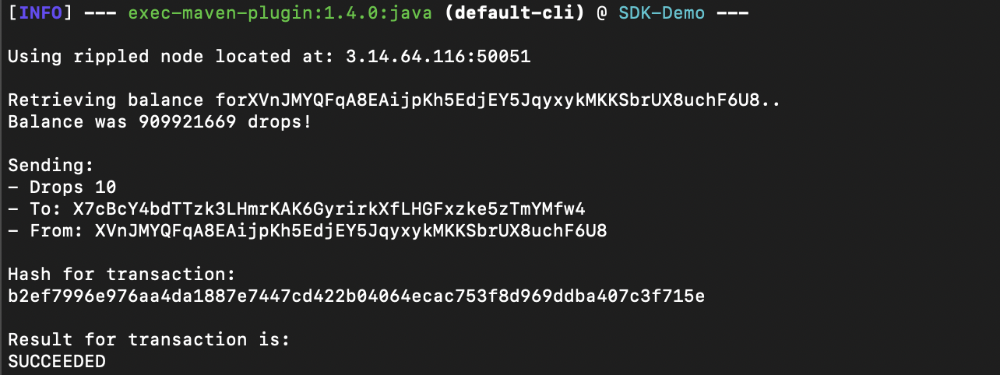

# Java Demo



This demo builds using [Maven](https://maven.apache.org/what-is-maven.html) but it is also possible to use xpring4j with [Gradle](https://gradle.org/).

Demonstrates the XRP and ILP APIs in [xpring4j](http://github.com/xpring-eng/xpring4j). 

To build and run the XRP demo:
```shell
# Install required tooling
brew install maven

# Build and run demo
mvn package exec:java@xrp
```

To build and run the ILP demo:
```shell
# Install required tooling
brew install maven

# Build and run demo
mvn package exec:java@ilp
```

