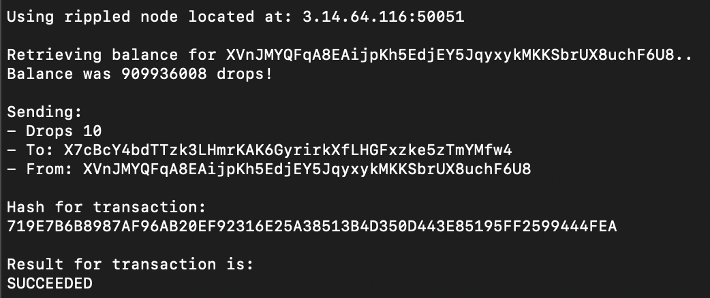
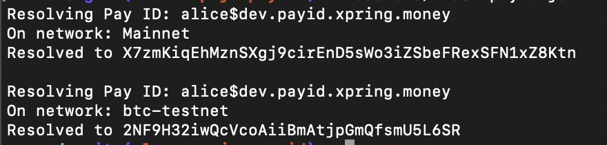
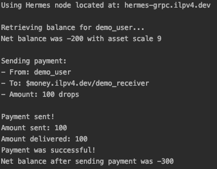

# Node Demo

## XRP



Demonstrates the XRP API in [Xpring-JS](http://github.com/xpring-eng/xpring-js).

To build:

```shell
# Install dependencies
npm i

# Run
node src/index-xrp.js
```

## PayID



Demonstrates the PayID API in [Xpring-JS](http://github.com/xpring-eng/xpring-js).

To build:

```shell
# Install dependencies
npm i

# Run
node src/index-payid.js
```

## ILP



Demonstrates the ILP API in [Xpring-JS](http://github.com/xpring-eng/xpring-js).

To build:

```shell
# Install dependencies
npm i

# Run
node src/index-ilp.js
```
