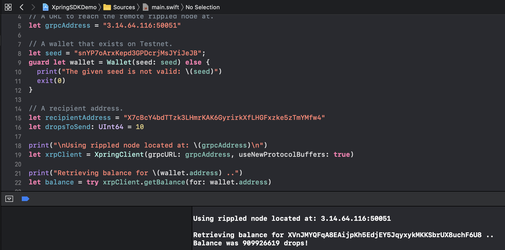

# Swift Demo



Demonstrates [XpringKit](http://github.com/xpring-eng/xpringkit). 

This demo builds using [Carthage](https://github.com/Carthage/Carthage) but it is also possible to build XpringKit with [CocoaPods](https://cocoapods.org/).

There are demos provided for:
- XRP Components
- PayID Components
- ILP Components
- Xpring Components

To build:
```shell
# Install required tooling
brew install carthage swiftlint

# Install dependencies
carthage bootstrap

# Run in XCode.
# Use the target chooser to run different demos.
open XpringSDKDemo.xcodeproj
```

